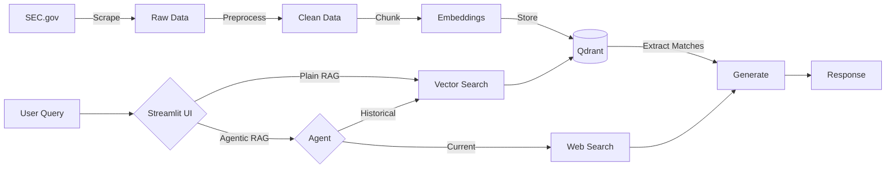

# 🏦 Financial Crime Compliance Assistant

An intelligent RAG-powered system designed to help KYC/AML analysts investigate financial crimes by providing instant access to SEC enforcement cases with both historical document search and real-time web search capabilities.

[](https://www.python.org/downloads/)
[](https://github.com/langchain-ai/langchain)
[](https://streamlit.io/)
[](https://www.docker.com/)

## 🎯 Problem Statement

Financial compliance officers and KYC analysts spend 2-4 hours per client manually reviewing SEC enforcement documents, news articles, and public records to identify financial crime connections. This manual process leads to:

- **Delayed risk assessments** and missed regulatory red flags
- **Multi-billion dollar fines** for AML violations (TD Bank: $3B in 2023, Deutsche Bank: $130M, HSBC: $1.9B)
- **Reputational damage** from unknowingly doing business with criminals
- **Limited coverage** due to inability to synthesize information across hundreds of documents

**This system automates that process**, reducing investigation time from hours to seconds while improving the quality and comprehensiveness of risk assessments.

## ✨ Features

### 🤖 Dual RAG Modes

#### Plain RAG
- Fast document-only retrieval from SEC enforcement database
- Best for historical case lookups and penalty comparisons
- **10-15 seconds per query** in Streamlit Cloud. Under 10 seconds locally
- **Faithfulness: 0.925** (highly accurate citations)

#### Agentic RAG
- Intelligent agent that automatically selects between:
  - **SEC Document Search**: Internal database of 500 enforcement cases
  - **Tavily Web Search**: Real-time web search for current events
- Multi-step reasoning with tool orchestration
- Best for current events, complex queries requiring multiple sources
- **~10-15 seconds per query** in Streamlit Cloud

### 📊 Key Capabilities

- **Natural Language Queries**: Ask questions in plain English
- **Automatic Tool Selection**: Agent decides whether to search documents or web
- **Source Citations**: Every answer includes SEC.gov URLs and LR numbers
- **Metadata Enrichment**: Automatically categorizes crimes, extracts entities and dollar amounts
- **Evaluation Dashboard**: Real-time performance metrics in Streamlit UI
- **Conversation History**: Track previous queries and responses

## 🏗️ Architecture



**See [assets/project_architecture.png](assets/project_architecture.png) for detailed system architecture.**

## 🚀 Quick Start

Access the [Streamlit app](https://financial-crime-assistant.streamlit.app/)

Note: - If you receive an error related to Qdrant, it is quite likely because another user may have left the app open. Since the database is running locally, only one instance is allowed. In order to fix it, click on the three vertical dots in the upper-right corner of the page, and hit `Rerun` to see if that fixes the error. Otherwise, contact me on Discord

### Prerequisites

- Python 3.11 or higher
- Docker and Docker Compose (for containerized deployment)
- OpenAI API key
- Tavily API key (optional, for web search)
- Cohere API key (optional, for reranking)
- LangSmith API key (optional, for monitoring)

### Installation

#### Option 1: Docker Deployment (Recommended)

1. **Clone the repository:**
   ```bash
   git clone https://github.com/yourusername/financial_crime_assistant.git
   cd financial_crime_assistant
   ```

2. **Create environment file:**
   ```bash
   cp .env.example .env
   # Edit .env and add your API keys
   ```

3. **Install libraries:**
   ```bash
      uv sync
   ```

4. **Build and run with Docker Compose:**
   ```bash
   docker-compose up --build
   ```

5. **Access the application:**
   ```
   http://localhost:8501
   ```

#### Option 2: Local Development

1. **Clone the repository:**
   ```bash
   git clone https://github.com/yourusername/financial_crime_assistant.git
   cd financial_crime_assistant
   ```

2. **Install dependencies with uv (recommended):**
   ```bash
   # Install uv if you haven't already
   curl -LsSf https://astral.sh/uv/install.sh | sh
   
   # Create virtual environment and install dependencies
   uv venv
   source .venv/bin/activate  # On Windows: .venv\Scripts\activate
   uv pip install -e .
   ```

3. **Install libraries:**
   ```bash
      uv sync
   ```
4. **Export PYTHONPATH to the project environment:**
   ```bash
   export PYTHONPATH=$PYTHONPATH:$PWD
   ```

5. **Set up environment variables:**
   ```bash
   cp .env.example .env
   # Edit .env and add your API keys
   ```

 6. **Run the data pipeline (if starting fresh):**
    ```bash
    # Option 1: Run complete pipeline with master script
    python run_ingestion_pipeline.py
    
    # Option 2: Run steps individually
    python src/scrapers/sec_scraper.py           # Step 1: Scrape
    python src/ingestion/preprocesser.py         # Step 2: Preprocess  
    python src/ingestion/loader.py               # Step 3: Load to Qdrant
    ```

7. **Launch the Streamlit app:**
   ```bash
   streamlit run streamlit_app.py
   ```

8. **Access the application:**
   ```
   http://localhost:8501
   ```

## 🛠️ Project Structure

```
financial_crime_assistant/
├── src/
│   ├── scrapers/
│   │   └── sec_scraper.py          # Web scraper for SEC documents
│   ├── ingestion/
│   │   ├── preprocesser.py         # Document preprocessing and cleaning
│   │   ├── chunker.py              # Text chunking strategy
│   │   └── loader.py               # Qdrant vector store management
│   ├── rag/
│   │   ├── retriever.py            # Plain RAG implementation
│   │   ├── evaluate_rag.py         # RAGAS evaluation
│   │   └── generate_testset.py     # Test data generation
│   └── utils/
│       └── document_utils.py       # Utility functions
├── data/
│   ├── raw/                        # Raw scraped documents
│   ├── processed/                  # Preprocessed documents
│   └── kg/                         # Knowledge graph data (future)
├── qdrant_data/                    # Qdrant vector store (persisted)
├── evaluation/
│   ├── retriever/                  # Retriever evaluation results
│   └── *.jsonl                     # RAGAS test sets
├── deliverables/
│   ├── README.md                   # Assignment deliverables
│   └── assets/                     # Architecture diagrams
├── streamlit_app.py                # Main Streamlit application
├── pyproject.toml                  # Project dependencies
├── Dockerfile                      # Docker configuration
├── docker-compose.yml              # Docker Compose orchestration
├── .env.example                    # Environment variables template
└── README.md                       # This file
```

## 🔧 Configuration

### Environment Variables

Populate `.env` file with the required keys:


### Chunking Configuration

Edit `src/ingestion/chunker.py`:

```python
chunk_size = 750      # Tokens per chunk
chunk_overlap = 100   # Token overlap between chunks
```

### Retrieval Configuration

Edit `streamlit_app.py`:

```python
search_kwargs = {"k": 5}  # Number of chunks to retrieve
```

## 📊 Data Pipeline

### 1. Scraping SEC Documents
```bash
python src/scrapers/sec_scraper.py
```
- Scrapes 500 SEC litigation releases (configurable)
- Async scraping with rate limiting
- Outputs to `data/raw/sec_releases_batch_*.json`

### 2. Preprocessing
```bash
python src/ingestion/preprocesser.py
```
- Unicode normalization
- Navigation/boilerplate removal
- Entity extraction (people, amounts, crime types)
- Outputs to `data/processed/sec_releases_batch_*_clean.json`

### 3. Loading to Vector Store
```bash
python src/ingestion/loader.py
```
- Chunks documents (750 tokens, 100 overlap)
- Generates embeddings (OpenAI text-embedding-3-small)
- Loads into Qdrant (`./qdrant_data/`)
- Creates ~550 chunks from 500 documents

## 🧪 Evaluation

### Generate Test Set
```bash
python src/rag/generate_testset.py
```

### Run Evaluation
```bash
python src/rag/evaluate_rag.py
```

Results saved to `evaluation/retriever/retriever_evaluation_results.csv`

## 🐳 Docker Deployment

### Build and Run
```bash
# Build the image
docker-compose build

# Run the container
docker-compose up

# Run in background
docker-compose up -d

# View logs
docker-compose logs -f

# Stop the container
docker-compose down
```

## 🚧 Limitations

### Current Constraints
- **Document Coverage**: 500 SEC cases (2023-2025 only)
- **Language**: English only
- **Data Freshness**: Manual scraping required for updates
- **Latency**: 47-90 seconds per query (acceptable for compliance, not real-time)
- **Scale**: Optimized for <10K documents

### Known Issues
- **Answer Relevancy Drop**: Advanced retrieval shows 4.4% decrease in answer relevancy (tuning in progress)
- **Entity Recall**: 53% entity recall (room for improvement via hybrid search)
- **No Multi-Turn Chat**: Each query is independent (no conversation context)

## 📚 Documentation

- **[System Architecture](assets/agentic_rag_architecture.png)**: Detailed technical architecture
- **[Assignment Deliverables](deliverables/README.md)**: AI Makerspace certification deliverables
- **[Evaluation Results](evaluation/retriever/)**: RAGAS evaluation reports

## 📄 License

This project is licensed under the MIT License - see the [LICENSE](LICENSE) file for details.

## 🙏 Acknowledgments

- **AI Makerspace**: For the certification challenge and guidance
- **LangChain Community**: For excellent RAG frameworks
- **SEC.gov**: For publicly accessible enforcement data
- **Cohere**: For high-quality reranking models
- **OpenAI**: For GPT-4o-mini and embedding models

