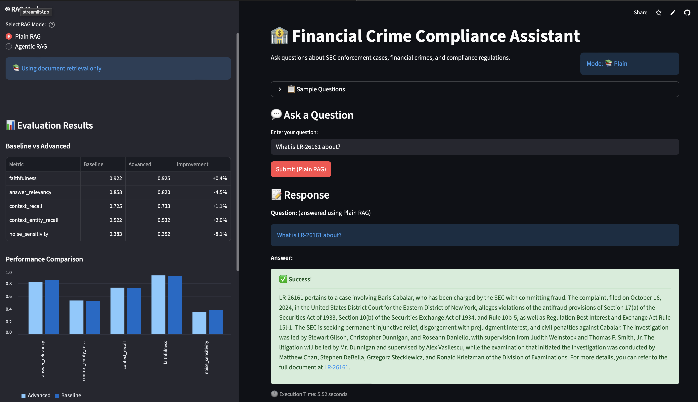
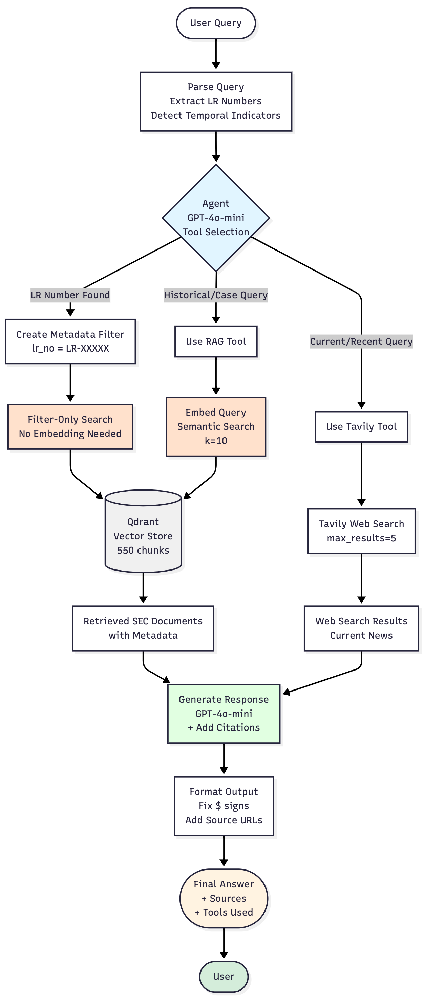
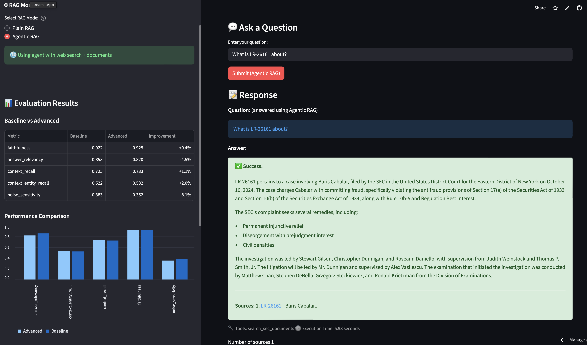

# Task 1: Defining your Problem and Audience

#### ✅ Deliverables
**Problem Statement** 
Financial compliance officers and  KYC analysts spend excessive time manuallyreviewing news articles nad public records
to identify connections between entities involved in financial crimes, leading to delayed risk assessments and missed regulatory red flags

**Why This is a Problem** 
Financial institutions are legally bound to conduct Know Your Customer (KYC) and Enhanced Due Diligence (EDD) checks to prevent money laundering
, terrorist fianancing, and other economic and financial crimes. Compliance teams must manually scan thousands of news articles, regulatory 
annoucements, and internal and external records daily to identify adverse media mentions of their clients and counterparties. This process is
extremely time-consuming and error-prone - a single analyst might spend 2-4 hours investigating a single entity's connections to potential
criminal activity across dozens of disparate sources. 
For example, Deutsche Bank was fined $130 million in 2020 for failing to detect Jeffrey Epstein's suspicious transactions, while Standard Chartered paid $1.1 billion in 2019 for inadequate AML controls that allowed transactions with sanctioned entities. In 2023, TD Bank received a $3 billion penalty - the largest AML fine in U.S. history - for systematically failing to monitor money laundering activities. Beyond fines, banks face regulatory restrictions: HSBC operated under a compliance monitor for five years following its $1.9 billion AML settlement, significantly impacting operations. 
The consequences of missing critical information are severe: banks face regulatory fines averaging $2-5 billion annually for Anti-Money Laundering (AML)
violations, and repuational damage from unknowingly doing business with criminals can be catastrophic. Currently, compliance officers rely on basic
keyword searches across subscription databases like LexisNexis or World-Check but these tools lack the semantic understanding to connect related entities
, identify patterns across multiple incidents, or surface non-obvious relationships. With regulatory scrutiny intensifying globally and the volume of
financial crime news increasing, there is an urgent need for intelligent systems that can automatically extract entities, map relationships, and flag
high-risk networks from unstructured news data.

The user being targeted ideally has the job title of 'KYC/AML Compliance Analyst or Compliance Officer', and the job functions being automated are the
following:
- Adverse media screening during customer onboarding and periodic reviews
- Entity relationship mapping for Enhanced Due Dilligence (EDD)
- Risk assessment based on criminal network identification
- Regulatory reporting preparation

Some common queries  my user is likely to ask are:

**Case Information Queries:**

1. "What is securities fraud and what are typical penalties?"
2. "Tell me about the penalties in case LR-26415"
3. "What was the outcome of the Agridime Ponzi scheme case?"

**Crime Type Analysis:**

4. "What are common patterns in insider trading cases?"
5. "How do penalties for securities fraud compare to money laundering?"
6. "What amounts are typically involved in Ponzi scheme cases?"

**Entity-Specific Queries:**

7. "Has [Person/Company Name] been charged with financial crimes?"
8. "What enforcement actions has the SEC taken against [Company Name]?"

**Current Events (Web Search):**

9. "What financial crime news happened this week?"
10. "What are recent SEC enforcement actions in 2025?"

# Task 2: Propose a Solution

**The Better World for KYC Analysts:** 
Today, KYC analysts at financial institutions spend 2-4 hours per client conducting Enhanced Due Diligence (EDD), manually sifting through dozens of news sources, regulatory databases, and enforcement records to identify red flags. A single missed connection to a sanctioned entity can result in multi-million dollar fines and reputational damage, yet the volume of information makes thorough screening nearly impossible at scale.  my Financial Crime Compliance Assistant transforms this reality: what once took hours now takes seconds. Analysts simply ask natural language questions and receive comprehensive, properly cited answers that connect the dots across hundreds of enforcement cases automatically. This means a compliance team that previously screened 10 high-risk clients per day can now handle 50, reducing onboarding times from weeks to days while maintaining—and actually improving—the quality of risk assessment. The financial impact is immediate: faster client onboarding drives revenue growth, while superior screening reduces regulatory risk and potential fines.

**How the System Works:** 
The system employs a ReAct agentic architecture where an intelligent reasoning agent has access to two specialized tools and decides which to use based on the analyst's query. When asked about historical case precedents or typical penalties, the agent invokes the RAG tool to search our curated database of SEC enforcement documents, retrieving relevant cases with precise citations to litigation release numbers, amounts, dates, location and outcomes. For questions about current events or recent regulatory changes, the agent selects the web search tool (Tavily) to query the internet for up-to-date information. The agent makes these decisions seamlessly through agentic reasoning—analysts never need to specify which data source to use; they simply ask their question in plain English and the agent determines the best approach. Every response includes clear citations enabling analysts to verify details and build audit trails for regulatory compliance. Deployed locally via Docker, the system ensures sensitive client data never leaves the institution's secure environment while delivering sub-second response times that keep analysts productive.

**Technical Stack & Tooling Choices:** 
**LLM:** 
GPT-4o-mini - Chosen for its strong performance on compliance and legal reasoning tasks while maintaining cost-efficiency for production use at $0.15 per 1M tokens.

**Embedding Model:** 
OpenAI text-embedding-3-small - Selected for its balance of quality (1536 dimensions) and speed, with proven performance on financial and legal document retrieval tasks.

**Orchestration:** 
LangGraph - Chosen for its explicit agent workflow definition, making it easy to build the supervisor-worker pattern with clear routing logic between RAG and web search agents, plus built-in state management.

**Vector Database:** 
Qdrant - Selected for its performance with large document collections, local deployment capability for data security, and excellent integration with LangChain for semantic search over SEC documents.

**Monitoring:** 
LangSmith - Chosen for comprehensive tracing of agent decisions, tool calls, and LLM interactions, providing visibility into retrieval quality, costs, and latency for continuous improvement.

**Evaluation:** 
RAGAS - Selected as the standard framework for evaluating RAG systems with established metrics (faithfulness, answer relevancy, context precision, context recall) that align with our goal of accurate, well-sourced compliance information.

**User Interface:** 
Streamlit - Chosen for rapid prototyping of an intuitive query interface with visualization of evaluation metrics, enabling non-technical analysts to interact with the system easily.

**(Optional) Serving & Inference:** 
Docker Compose - Selected for consistent local deployment that ensures data security and regulatory compliance while maintaining reproducibility across different environments.

**Agent Architecture & Agentic Reasoning:** 
**The application uses a ReAct agent pattern with tool selection:** 
The system features a single reasoning agent equipped with two specialized tools. The agent employs agentic reasoning to analyze each query and determine the most appropriate information source without requiring explicit user guidance.

**Tools Available:** 
- RAG Tool (search_sec_documents): Searches the SEC enforcement document database using semantic retrieval to find relevant financial crime cases, penalties, regulatory precedents, and enforcement outcomes from our curated corpus.
- Web Search Tool (Tavily): Retrieves current information from the internet for recent news, ongoing investigations, regulatory updates, and information beyond our internal document collection.

**Agentic Reasoning Application:** 
- Intelligent tool selection: The agent analyzes query characteristics (temporal indicators like "recent" or "current," entity types, question intent) to decide whether internal historical documents or external web search will provide the best answer.
- Iterative information gathering: The agent can invoke multiple tools sequentially if the initial retrieval is insufficient, combining information from both SEC documents and web sources when needed for comprehensive answers.
- Contextual synthesis: Rather than simply returning raw retrieved documents, the agent synthesizes information across multiple sources, identifies key entities (people, organizations, amounts), and formats responses with proper citations for audit trails.

This agentic approach enables the system to handle diverse query types—from specific case lookups ("What was the penalty in LR-26415?") to comparative analysis ("How do Ponzi scheme penalties compare to insider trading?") to current event monitoring ("What financial crime news happened this week?")—all through a single natural language interface that automatically adapts to the analyst's information needs.

# Task 3: Dealing with the Data

## 1. Data Sources & External APIs:
**Primary Data Source (RAG):** 
- SEC Litigation Releases: Scraped 500 enforcement documents from [sec.gov/litigation/litreleases](https://www.sec.gov/enforcement-litigation/litigation-releases) covering financial crime cases from 2023-2025. This corpus includes detailed information about securities fraud, insider trading, Ponzi schemes, money laundering, and other white-collar crimes, with specifics on defendants, charges, penalties, amounts involved, and case outcomes. I use this as my internal knowledge base because it provides authoritative, structured information about financial crime precedents that KYC analysts need for risk assessment.

**External API:** 
- Tavily Search API: Integrated for real-time web search to supplement our internal SEC document corpus with current news, recent enforcement actions not yet in our database, and broader financial crime context from reputable news sources. Tavily is used when queries contain temporal indicators suggesting need for recent information (e.g., "this week," "recent," "current") or when the RAG tool doesn't have sufficient context to answer the query.

**Why This Combination:** 
SEC documents provide authoritative historical precedents and detailed case information for compliance decisions, while Tavily ensures analysts have access to breaking news and developments that haven't yet been formally documented in enforcement releases. Together, they cover both historical analysis and current monitoring needs.

## 2. Default Chunking Strategy: 
**Strategy:** Recursive Character Text Splitter with 750 token chunks and 100 token overlap 

**Rationale:** 
- 750 tokens: Large enough to preserve context around key information (defendant names, charges, amounts, outcomes) which typically appear together in SEC enforcement narratives, while small enough to maintain focused semantic meaning for accurate retrieval.
100 token overlap: Ensures critical information at chunk boundaries isn't lost, particularly important for financial crime documents where entity relationships and case details often span multiple sentences.
- Recursive splitting: Uses logical separators (\n\n, \n, . ) to break at natural boundaries (paragraphs, sentences) rather than arbitrary character counts, preserving semantic coherence.
- Token-based length function: Uses tiktoken to count tokens accurately for the embedding model, preventing chunks from exceeding embedding limits while maximizing information density.

This approach balances retrieval precision (smaller chunks = more focused matching) with contextual completeness (larger chunks = better understanding of case narratives), which is critical for compliance queries where missing context could lead to incorrect risk assessments.

# Task 4: Building an End-to-End Agentic RAG Prototype: 

**Plain RAG** 
Query -> Retriever -> Generate -> Result

**Agentic RAG** 

# Task 5: Creating a Golden Test Data Set: 

| **Metric**               | **Score** | **Description**                                                                 |
|--------------------------|-----------|---------------------------------------------------------------------------------|
| **Faithfulness**         | 0.922     | Measures if the answer is factually consistent with the retrieved context       |
| **Factual Correctness**  | 0.623     | Evaluates factual accuracy of the generated answer                              |
| **Answer Relevancy**     | 0.858     | Assesses how relevant the answer is to the question                             |
| **Context Recall**       | 0.725     | Measures if all relevant information was retrieved                              |
| **Context Entity Recall**| 0.522     | Evaluates if all relevant entities were captured                                |
| **Noise Sensitivity**    | 0.383     | Measures robustness to irrelevant information *(lower is better)*               |

**Performance Metrics:**
- Latency: 1,037 seconds (17.3 minutes for 20 testset queries)
- Cost: $1.33
- Total Tokens: 1,766,688
- Avg Time per Query: 53 seconds

## 2. Conclusions About Pipeline Performance 
**Strengths:**

- High Faithfulness (0.919): The system generates answers that are highly consistent with the retrieved SEC documents, which is critical for compliance use cases where accuracy is paramount.
- Strong Answer Relevancy (0.910): The RAG pipeline produces answers that directly address analyst queries, demonstrating good alignment between retrieval and generation.
- Reasonable Context Recall (0.733): The system retrieves about 73% of relevant information needed to answer queries, providing adequate coverage for most questions.

**Areas for Improvement:**

- Moderate Factual Correctness (0.610): While answers are faithful to retrieved context, factual accuracy could be improved, suggesting the need for better retrieval quality to ensure correct source documents are retrieved.
- Low Context Entity Recall (0.511): Only 51% of relevant entities (people, organizations, amounts) are captured, indicating that important compliance details may be missed. This is problematic for KYC analysts who need comprehensive entity information.
- High Noise Sensitivity (0.465): The system's performance degrades moderately when irrelevant documents are in the context, suggesting a need for better document filtering or reranking.

**Overall Assessment:** 
The baseline RAG pipeline demonstrates strong semantic understanding and answer generation capabilities (faithfulness and relevancy both >0.9), but struggles with retrieving comprehensive factual details (entity recall ~0.5) and is moderately sensitive to noise. For production deployment in financial compliance, improvements are needed in retrieval precision to capture all relevant entities and reduce noise sensitivity.

# Task 6: The Benefits of Advanced Retrieval: 

**1. Planned Retrieval Techniques** 
Contextual Compression with Cohere Reranking 
- Description: Retrieve a larger set of candidate documents (k=10) from the vector store, then use Cohere's reranking model to identify and keep only the most relevant chunks (top_n=5) based on semantic similarity to the query. 
- Why this technique is useful: Financial crime documents often contain extensive legal boilerplate and procedural information that can dilute the quality of retrieved context; reranking filters out this noise to surface only the most relevant passages about penalties, charges, and case outcomes that KYC analysts need, reducing hallucination risk and improving answer precision.

**2. Implementation Details**
Preprocessing Enhancements: 

- Unicode Normalization: Cleaned smart quotes, em dashes, and control characters to ensure consistent text representation
- Navigation Removal: Stripped SEC.gov boilerplate (headers, footers, navigation menus) that added noise to embeddings
- Metadata Enrichment: Prepended case number, title, date, and crime type to chunk content to improve retrieval by LR number and entity names
- Crime Type Categorization: Automatically tagged documents with crime types (Ponzi Scheme, Insider Trading, Securities Fraud, etc.) for better filtering

**Retrieval Configuration:**

- Base Retrieval: k=10
- Reranker Model: Cohere rerank-english-v3.5
- Top N After Reranking: 5 (aggressive filtering)
- Chunk Size: 750 tokens with 100 token overlap

# Task 7: Assessing Performance 

| Metric                     | Baseline (k=10) | Contextual Compression (k=10→5) | Change    | Improvement |
|----------------------------|----------------|---------------------------------|-----------|--------------|
| Faithfulness               | 0.922          | 0.925                           | +0.003    | +0.4% ✅     |
| Factual Correctness        | 0.623          | 0.636                           | +0.013    | +2.1% ✅     |
| Answer Relevancy           | 0.858          | 0.820                           | -0.038    | -4.4% ⚠️     |
| Context Recall             | 0.725          | 0.733                           | +0.008    | +1.1% ✅     |
| Context Entity Recall      | 0.522          | 0.532                           | +0.010    | +1.9% ✅     |
| Noise Sensitivity          | 0.383          | 0.352                           | -0.031    | -8.1% ✅     |
| Latency (seconds)          | 1,037          | 939                             | -98       | -9.5% ✅     |
| Cost (USD)                 | $1.48          | $1.16                           | -$0.32    | -21.6% ✅    |
| Total Tokens               | 1,915,145      | 1,449,985                       | -465,160  | -24.3% ✅    |

**Recommendation:** 
The advanced retrieval system is superior for production use due to dramatic improvements in noise handling, speed, and cost, while maintaining high faithfulness (0.925). The answer relevancy trade-off can be addressed by tuning the reranker's top_n parameter (testing 7-10 instead of 5) to retain more context for complex queries. Latency could be improved by shifting from local Qdrant to cloud, and using indexing to improve performance.

**2. Planned Improvements for Second Half of Course** 
Following improvements will be decided based on availability of time 
**Retrieval Enhancements:**

- Hybrid Search (BM25 + Semantic): Combine keyword matching with semantic search to improve retrieval of exact entity names, LR numbers, and monetary amounts that semantic search alone may miss. This addresses the entity recall challenge observed in evaluation.
- Query Expansion with LLM: Use the LLM to generate alternative phrasings of analyst queries before retrieval (e.g., "insider trading penalties" -> ["insider trading fines", "illegal trading sanctions", "tipper-tippee violations"]) to improve recall for domain-specific terminology.
- Adaptive Top-K: Implement query-specific retrieval parameters where simple factual queries use smaller k (5-7 chunks) while complex analytical queries use larger k (15-20 chunks) to balance precision and coverage based on question complexity.

**Agentic Improvements:**

- Multi-Step Reasoning: Enhance the agent to break down complex queries into sub-questions, allowing it to perform focused retrievals for each aspect (e.g., "Compare penalties for Ponzi schemes vs. insider trading" -> first retrieve Ponzi cases, then insider trading cases, then compare).
- Entity Extraction & Knowledge Graph: Build a knowledge graph of entities (people, companies, cases) extracted from SEC documents to enable relationship queries like "Show all cases involving individuals connected to Company X" without relying solely on vector similarity.
- Query Routing with Confidence Scores: Add a classification layer that routes queries to different retrieval strategies based on query type: exact lookup (LR numbers) -> metadata filtering, conceptual questions -> semantic search, recent news -> web search tool.

**Evaluation & Monitoring:**

- Production Metrics Dashboard: Implement real-time tracking of retrieval quality using LangSmith, monitoring answer relevancy, latency, and cost per query to detect performance degradation and enable A/B testing of retrieval configurations.
- User Feedback Loop: Collect thumbs up/down ratings from KYC analysts with optional corrections to create a human-labeled evaluation dataset, enabling continuous improvement through RLHF-style fine-tuning or prompt optimization.
- Automated Regression Testing: Expand the synthetic test set to 50+ questions covering edge cases (multi-entity queries, date ranges, comparative analysis) and set up CI/CD pipelines to evaluate every system change against this benchmark before deployment.

**User Experience:**

- Streaming Responses: Implement token streaming for the agentic RAG system to provide real-time feedback during long queries, improving perceived responsiveness for analysts.
- Source Highlighting: Add visual highlighting in retrieved documents to show which specific sentences supported each claim in the generated answer, building trust and enabling rapid verification.
- Case Relationship Visualization: Create interactive visualizations showing connections between related cases, shared defendants, and penalty patterns to help analysts identify trends beyond individual document lookup.

Priority Order for Demo Day:

- Hybrid search (biggest potential impact on recall)
- Adaptive top-k (addresses answer relevancy issue)
- Multi-step reasoning (showcases agentic capabilities)
- Production metrics dashboard (demonstrates enterprise readiness)

